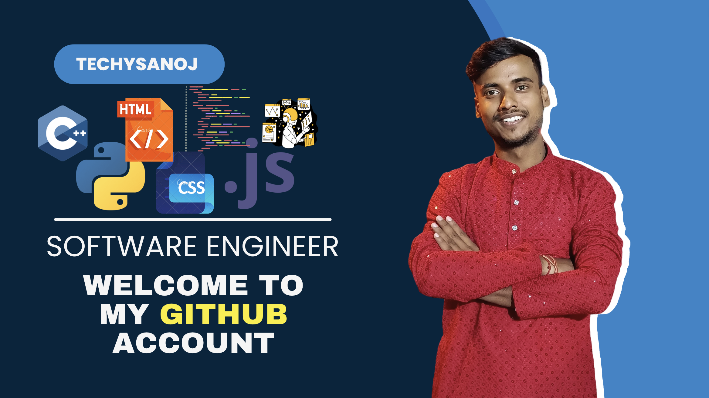

# Hi there! I'm Sanoj Kumar 👋

  

  

    
    
    
    
  

## 🚀 About Me

I'm a **Conversational AI Engineer** at **Omli Kids**, building intelligent voice and language experiences. My work sits at the intersection of AI, language models, and real-world product engineering.

- 🎙️ **Voice AI Pipelines** — Designing end-to-end conversational voice systems with real-time processing
- 🤖 **LLM Engineering** — Building and fine-tuning language models for production use cases
- 🌐 **Full-Stack Development** — Shipping products with React, Next.js, Node.js and modern web tooling
- 🧠 **Open Source ML** — Co-created [avishkaarak-ekta-hindi](https://huggingface.co/AVISHKAARAM/avishkaarak-ekta-hindi), a RoBERTa-based Hindi-English QA model (F1: 82.91%)

## 🛠️ Tech Stack

  **AI · LLM · Voice**

  
  
  
  
  
  

  **Web Development**

  
  
  
  
  
  

  **Tools & Languages**

  
  
  

## 🚢 Featured Projects

### 🎨 [Skribblay.you](https://github.com/techysanoj/skribble-clone) — Skribbl.io clone

A real-time multiplayer drawing & guessing game inspired by Skribbl.io — built from scratch with a full custom backend.

- 🎮 Real-time gameplay via **WebSockets** (Socket.IO)
- 🏠 Customizable game rooms with multiple word pack options
- 💬 In-game chat, player scoring & leaderboard
- ⚡ React frontend + Node.js backend, MIT licensed

---

### 🧠 avishkaarak-ekta-hindi

A fine-tuned **RoBERTa-based extractive QA model** for Hindi-English, trained on SQuAD 2.0.

- **Exact Match**: 79.87% &nbsp;|&nbsp; **F1 Score**: 82.91%
- Handles both answerable and unanswerable questions
- Trained on 4× Tesla V100 GPUs

## 📊 GitHub Stats

  
  

  

## 🏆 Achievements

  

## 📈 Contribution Graph

  

## 📫 Connect With Me

  
  
  

## ⚡ Dev Quote

  

---

  

  <h4>Thanks for visiting! 🙌</h4>

